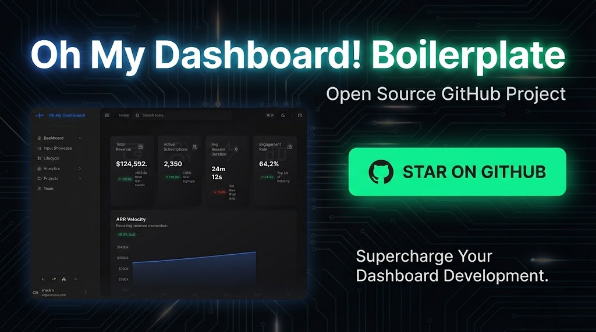

<div align="center">
  
  
  # OhMyDashboard!
  
  **An immersive, feature-rich Next.js dashboard workspace with floating tool windows, animated backgrounds, and a beautiful glass-morphism design.**
  
  [](https://oh-my-dashboard.vercel.app/)
  [](https://nextjs.org/)
  [](https://www.typescriptlang.org/)
  [](https://tailwindcss.com/)
</div>

---

## Live Demo

Check out the live demo: **[https://oh-my-dashboard.vercel.app/](https://oh-my-dashboard.vercel.app/)**

---

## Features

### Dashboard & Analytics
- **Metrics Cards** - Revenue, subscriptions, engagement, and session metrics with trend indicators
- **Interactive Charts** - Traffic pie charts, user growth line charts, regional sales bar charts, and system health radar charts
- **Draggable Dashboard Grid** - Customizable grid layout using `react-grid-layout`
- **ARR Velocity, Pipeline Momentum, Profit Quality** - Advanced business metric cards

### Floating Tool Windows
A macOS-like dock system with draggable, resizable, and minimizable tool windows:

| Tool | Description |
|------|-------------|
| **Emoji Picker** | Browse and insert emojis with category filtering |
| **Calculator** | Perform calculations with keyboard support |
| **Unit Converter** | Convert between various units of measurement |
| **Password Generator** | Generate secure passwords with customizable options |
| **UUID Generator** | Generate unique identifiers |
| **Lorem Ipsum** | Generate placeholder text for designs |
| **Stopwatch** | Time tracking with lap functionality |
| **Text Case** | Transform text between different cases |
| **Aspect Ratio** | Calculate aspect ratios for dimensions |

### Animated Backgrounds
Choose from 4 stunning animated background variants:
- **Aurora** - Flowing aurora borealis effect
- **Geometric** - Floating geometric shapes
- **Grid** - Interactive particle grid
- **Neural** - Neural network-inspired animation

### Theme System
- **Light/Dark Mode** - Toggle between themes with smooth transitions
- **Color Schemes** - Multiple accent color options via draggable gradient selector
- **Persistent Preferences** - Theme settings saved to cookies/localStorage

### Console Drawer (Konssole)
Expandable drawer panel in the sidebar footer with three tabs:
- **Console** - Terminal-style interface with animated cube visualization
- **Metrics** - System performance metrics
- **Network** - Network activity monitoring

### Command Palette
Press `⌘K` (or `Ctrl+K`) to open the command palette for:
- Quick navigation
- Tool access
- Search functionality

---

## Keyboard Shortcuts

| Shortcut | Action |
|----------|--------|
| `⌘K` / `Ctrl+K` | Open/close Command Palette |
| `⌘B` / `Ctrl+B` | Toggle left sidebar |
| `?` | Show keyboard shortcuts help |
| `Ctrl/⌘ + ↑` | Expand both sidebars |
| `Ctrl/⌘ + ↓` | Collapse both sidebars |
| `Ctrl/⌘ + ←` | Collapse left sidebar |
| `Ctrl/⌘ + →` | Collapse right sidebar |
| `Escape` | Close dialogs/command palette |

---

## Tech Stack

### Framework & Core
- **[Next.js 16](https://nextjs.org/)** - React framework with App Router
- **[React 19](https://react.dev/)** - UI library
- **[TypeScript 5](https://www.typescriptlang.org/)** - Type-safe JavaScript

### Styling & Design
- **[Tailwind CSS 4](https://tailwindcss.com/)** - Utility-first CSS framework
- **[Framer Motion](https://www.framer.com/motion/)** - Animation library
- **[Radix UI](https://www.radix-ui.com/)** - Accessible component primitives
- **[Lucide](https://lucide.dev/)** & **[Tabler Icons](https://tabler.io/icons)** - Icon libraries
- **[liquid-glass-react](https://github.com/nicholasxuu/liquid-glass-react)** - Glass morphism effects

### State & Data
- **[Zustand](https://zustand-demo.pmnd.rs/)** - State management
- **[TanStack Query](https://tanstack.com/query)** - Server state management
- **[TanStack Table](https://tanstack.com/table)** - Headless table library
- **[React Hook Form](https://react-hook-form.com/)** - Form handling
- **[Zod](https://zod.dev/)** - Schema validation

### Charts & Visualization
- **[Recharts](https://recharts.org/)** - Charting library
- **[cmdk](https://cmdk.paco.me/)** - Command menu component

### UX Enhancements
- **[Lenis](https://lenis.studiofreight.com/)** - Smooth scroll
- **[Sonner](https://sonner.emilkowal.ski/)** - Toast notifications
- **[Vaul](https://vaul.emilkowal.ski/)** - Drawer component
- **[next-themes](https://github.com/pacocoursey/next-themes)** - Theme management

### Drag & Resize
- **[@dnd-kit](https://dndkit.com/)** - Drag and drop toolkit
- **[react-grid-layout](https://react-grid-layout.github.io/react-grid-layout/)** - Dashboard grid
- **[react-resizable](https://github.com/STRML/react-resizable)** - Resizable components

### Development
- **[Vitest](https://vitest.dev/)** - Unit testing
- **[ESLint](https://eslint.org/)** - Linting
- **[Husky](https://typicode.github.io/husky/)** - Git hooks
- **[lint-staged](https://github.com/okonet/lint-staged)** - Staged linting

---

## Getting Started

### Prerequisites
- Node.js 18+ 
- npm, yarn, pnpm, or bun

### Installation

```bash
# Clone the repository
git clone <your-repo-url>
cd OHHHBoiler-Doublesidebar

# Install dependencies
npm install
# or
yarn install
# or
pnpm install
# or
bun install
```

### Development

```bash
npm run dev
# or
yarn dev
# or
pnpm dev
# or
bun dev
```

Open [http://localhost:3000](http://localhost:3000) to see the result.

### Build

```bash
npm run build
npm run start
```

### Testing

```bash
npm run test
# or for CI
npm run test:ci
```

### Linting

```bash
npm run lint
```

---

## Project Structure

```
src/
├── app/                    # Next.js App Router pages
│   ├── (main)/            # Main layout routes
│   └── layout.tsx         # Root layout with providers
├── components/
│   ├── layout/            # Layout components (shell, sidebars, console)
│   └── ui/                # Reusable UI components
├── config/
│   ├── theme/             # Theme configuration
│   └── tools/             # Tool registry
├── features/
│   ├── command-menu/      # Command palette & tool windows
│   ├── dashboard/         # Dashboard widgets & charts
│   ├── dock/              # macOS-style dock
│   ├── keyboard-shortcuts/# Keyboard shortcuts modal
│   ├── theme-customizer/  # Theme switcher
│   └── tools/             # Floating tool implementations
├── infrastructure/
│   ├── api/               # API client
│   ├── query/             # React Query setup
│   ├── store/             # Zustand stores
│   └── theme/             # Theme infrastructure
├── lib/                   # Utility functions
├── providers/             # React context providers
├── stores/                # Zustand stores
└── types/                 # TypeScript definitions
```

---

## Deployment

The easiest way to deploy is using [Vercel](https://vercel.com):

[](https://vercel.com/new)

Check out the [Next.js deployment documentation](https://nextjs.org/docs/app/building-your-application/deploying) for more details.

---

## License

MIT License - feel free to use this project for personal or commercial purposes.

---

<div align="center">
  Made with ❤️ by the OMD team
</div>
